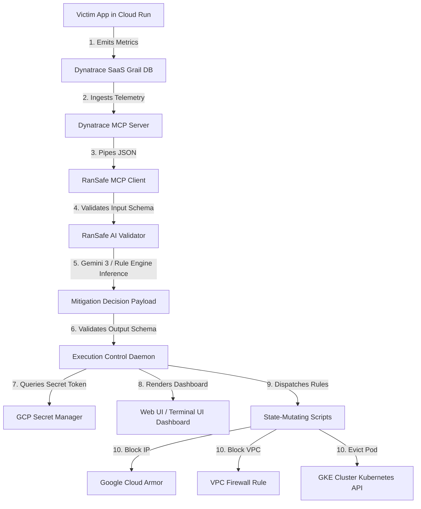

# 🛡️ RanSafe: Submission Walkthrough & Documentation

Welcome to the **RanSafe SRE Orchestrator** walkthrough! This guide provides a complete architectural map, deployment setup details, and step-by-step instructions to demonstrate the autonomous "Ransomware Airgap" circuit breaker.

---

## 🗺️ Architectural Ingestion & Action Pipeline

The RanSafe orchestrator runs a continuous reactive pipeline linking Dynatrace metrics ingestion to Gemini 3 reasoning, culminating in state-mutating Cloud API containment:



---

## 🏗️ Google Cloud Resource Mapping

The following resources have been provisioned in the Google Cloud Project `rapid-cloud-498915` (Organization: `lochan-bhavanasi-org`, Project Number: `453397284615`):

1. **GCP Artifact Registry (`ransafe-repo`)**:
   * Storing the built container image: `us-central1-docker.pkg.dev/rapid-cloud-498915/ransafe-repo/ransafe-sandbox:latest`
2. **GCP Cloud Run Service (`ransafe-sandbox`)**:
   * Running the victim Node.js microservice instrumented with OpenTelemetry.
   * **Endpoint URL**: `https://ransafe-sandbox-453397284615.us-central1.run.app`
3. **GCP Secret Manager (`ransafe-auth-key`)**:
   * Storing the SRE dispatch authorization credential (Value: `token123`).
4. **Google Cloud Armor Security Policy (`ransafe-armor-policy`)**:
   * Acting as the target firewall for dynamic IP block rules when containing compromised compute nodes.

---

## ⚙️ Initial Setup & Configurations

To run the orchestrator and validator locally, ensure your environment variables are configured.

1. Create a `.env` file at the root of the project:
   ```bash
   cp env .env
   ```
2. Verify that the `.env` contains the Dynatrace environment coordinates and your Gemini API key:
   ```env
   DYNATRACE_ENV_URL=https://qbu35590.live.dynatrace.com
   DYNATRACE_API_TOKEN=dt0c01.MFZSS...
   GEMINI_API_KEY=AIzaSy...
   ```
3. Install required Python packages for the validator and SRE dashboard:
   ```bash
   pip install jsonschema google-genai opentelemetry-api opentelemetry-sdk opentelemetry-exporter-otlp rich
   ```

---

## 🚀 Step-by-Step Live Walkthrough

Follow these phases to demonstrate the pipeline, trigger the ransomware threat simulation, and observe the active containment.

### Phase 1: Launch the SRE Web & Terminal UI Dashboard
The **Execution Control Daemon** listens for validator decisions, verifies tokens, and renders a status console.

Run the gateway daemon:
```bash
python3 execution/handler.py
```
* **Terminal UI**: Displays the **RanSafe ASCII banner**, Telemetry Metric Gauges (CPU, Write Ops, Entropy), and an Emergency Containment Checklist in real-time.
* **Web Interface**: Open your browser to [http://localhost:8080](http://localhost:8080) to view the premium dark-themed SRE web dashboard with flashing indicators and real-time logs.

### Phase 2: Run telemetry through the Continuous Pipeline
In a separate terminal window, start the end-to-end pipeline:
```bash
./run_orchestrator.sh --mode normal
```
* This fetches telemetry from the Cloud Run endpoint `ransafe-sandbox`, runs the schema-validator, and pipes the nominal workload metrics (`MONITOR_INTENSE` or `REALLOCATE_RESOURCES`) to the SRE console.
* Observe the dashboard status updating to **Nominal** (Green).

### Phase 3: Trigger the Ransomware Simulation
Now, trigger the cyberattack simulation to exceed thresholds:
1. In a separate shell, run the threat simulator inside the Cloud Run container sandbox:
   * (Alternatively, run the simulation pipeline locally using `--mode ransomware` to demo containment):
   ```bash
   ./run_orchestrator.sh --mode ransomware
   ```
2. The metrics will spike to:
   * **CPU utilization**: `> 90%`
   * **Filesystem write operations**: `> 400 ops/sec`
   * **Entropy coefficient**: `> 0.90` (representing file-write encryption)
3. The validator evaluates this threat profile and outputs `AIRGAP_NODE` with a dynamic authorization token `AUTH-TOKEN-ransafe-sandbox-AIRGAP_NODE`.

### Phase 4: Observe the Cyber-breaker Containment
1. The **Execution Control Daemon** intercepts the `AIRGAP_NODE` instruction, queries **GCP Secret Manager** to validate the token, and executes `execution/airgap_rules.sh`.
2. The UI dashboard flashes **CRITICAL ANOMALY AIRGAP ACTIVE** (Blinking Red) and begins checking off containment steps:
   - **GCP Cloud Armor Rule**: Created rule `1000` denying traffic to the target node.
   - **VPC Firewall Block**: Created firewall rule `ransafe-airgap-ransafe-sandbox` denying all ingress.
   - **IAM Privilege Revocation**: Revoked `roles/editor` role from the instance's associated Google Service Account.
   - **GKE Container Pod Eviction**: Evicted the pod from the namespace.
   - **Workload Replica Rollout**: Rollout started to deploy a clean replica container.

### Phase 5: Revert & Restore Infrastructure
Once the simulation is complete, revert the cloud environment back to nominal state:
```bash
./execution/restore_network.sh "ransafe-sandbox"
```
This automatically deletes the temporary Cloud Armor rules, VPC firewall rules, and restores standard IAM roles.

---

## 🧪 Verification & Testing Commands

To run automated unit tests and verify script functionality offline:

### A. Run Python validator and telemetry rule tests
```bash
python3 -m unittest agent/test_agent.py
```
*(All 9 tests will execute, validating the Gemini OTel Grail trace wrapping and schema assertions).*

### B. Run Node.js MCP telemetry contract tests
```bash
node agent/test_mcp_client.js
```
*(All 5 validation tests will verify strict telemetry schemas).*
